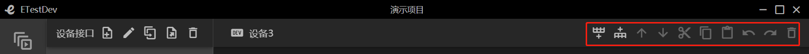
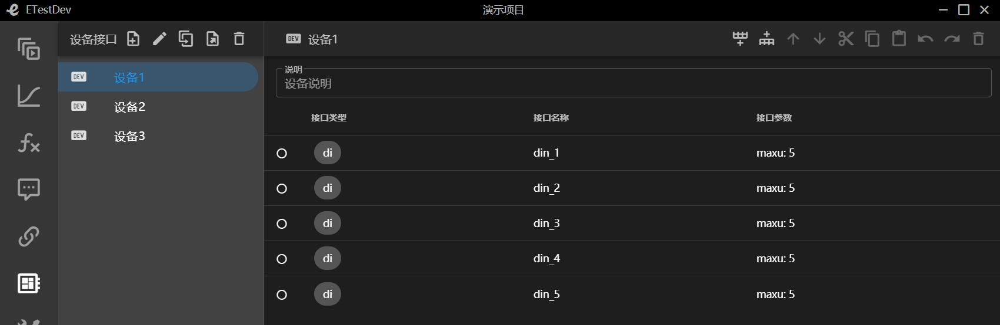
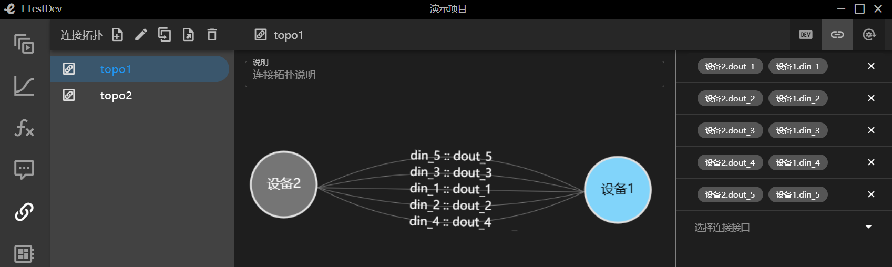

# 前言
## 什么是ETestDev
ETestDev是嵌入式系统测试开发工具套件，由多个开发组件构成，主要包括ETL编译器、测试程序执行器、监控界面渲染器、多个组件库，以及vscode插件、命令行工具等
## 入门教程简介
我们在本入门教程中将会完成一个基于ETestDev开发工具套件运行的一个演示项目的例子
### 项目库
项目库是本系统内的所有项目进行一个统一的管理，支持新建项目、重命名项目、删除项目、收索项目、项目导入、项目导出、项目排序等一系列操作
#### 新建项目
+ 点击新建项目，输入项目名称、选择创建方式(包括空项目、复制历史项目、从文件导入)
+ 新建成功后会显示项目的基本信息，包括创建时间、修改时间、用例总数、执行结果等信息
+ 点击项目名称会进入到该项目的工作空间下
+ 当项目名称存在时候回报错(项目名重复)
+ ``` 这里以演示项目为例```
#### 重命名项目
+ 点击项目名称，输入新的项目名称，回车
#### 删除项目
+ 项目首页点击删除按钮，确定，项目就被删除了
#### 项目检索
+ 项目检索支持按照项目名称的关键字进行检索
+ 收索栏中输入要搜索的关键字，系统会自动的匹配
#### 项目排序
+ 项目排序支持按照项目名称、创建时间、修改时间、用例总数、执行结果升序或者降序排列
+ 选择排序所需要的依据与排序的顺序，系统会自动对项目进行排序
#### 项目导出
+ 支持把项目导出为文件，包含本项目下的所有信息
#### 在新窗口打开
+ 当我们需要同时操作多个项目的时候，选择在新窗口打开
+ 这样我们就同时在多个窗口打开了多个项目

### 设备接口
设备接口是对本项目下的所有的设备、设备的接口、以及接口类型参数名称的一个统一的管理。支持设备、接口的新增编辑以及接口参数的配置等操作。以下所有操作均在设备接口菜单栏下进行操作
#### 设备新增
+ 点击新增按钮，输入设备名称(不支持特殊字符，全数字)回车
+ ```这里以新增设备1、设备2、设备3为例```
+ ```新增完成后如下图所示```

#### 设备删除
+ 选择要删除的设备，点击删除按钮
#### 设备说明
+ 选择设备，在设备说明栏中输入信息
+ 设备说明信息是实时保存状态
#### 接口功能说明
+ 如下所示依次为向前添加、向后添加、上移、下移、复制、粘贴、撤销、恢复、删除

#### 接口新增
+ 新增支持向前添加或者向后添加
+ 选择要增加的接口类型，输入数量与名称回车
+ 接口名称不支持特殊字符，全数字，系统会根据接口数量依次命名
+ ```这里给设备1增加类型为di的5个接口，名称分别为din_1~din_5，给设备增加类型为do的5个接口，名称分别为dout_1~dout_5```
+ ```设备1新增完成后如下图所示```

+ ```设备2新增完成后如下图所示```

+ 接口类型后面做详细介绍
#### 接口重命名
+ 选择接口名称，输出新名称(或者说明信息)确定，取消回退到上一步
+ 接口名称不可以重复
#### 接口移动
+ 接口移动分为上移、下移
+ 选中某一项，根据需求进行上下移动顺序的调整
#### 接口复制粘贴
+ 选中某一项接口时点击复制后就可以进行粘贴操作
+ 复制粘贴出的接口会出现接口名称重复的错误，需要及时修改名称
#### 接口撤销恢复
+ 撤销回复与前进一步后退一步相同
+ 出现操作失误等状况可以用此功能来解决
#### 接口删除
+ 选中要删除的那一项接口，点击删除
#### 接口类型
+ 接口类型共分为11种分别是di、do、ad、da、serial_232、serial_422、serial_485、serial_ttl、udp、tcp_client、tcp_server
+ di、do分别表示开关量的输入与输出。参数为最大工作电压，可以手动设置
+ ad、da分别表示模拟信号转变为数字信号，数字信号转换为模拟信号。可选参数为分辨率(包括8、16、32、64)
+ udp表示无连接的传输层协议。参数为IP地址、端口号、存活周期、是否复用地址端口
+ tcp_client、tcp_server分别表示tcp客户端与tcp服务端。参数为IP地址、端口号、是否长连接、是否禁用Nagle、是否自动连接
+ serial_232、serial_422、serial_485、serial_ttl分别表示串口232、422、485、ttl。参数均为可选参数波特率、数据位、停止位、校验方式、流控方式

### 连接拓扑
连接拓扑是表示项目下的设备接口的拓扑关系，支持拓扑新增、编辑、删除、设备的映射、接口的连接、运行时接口的绑定等信息

#### 连接拓扑新建
+ 点击新增按钮输入名称回车
+ 说明的信息栏中可以输入连接拓扑的详细说明
+ 拓扑名称不能重复不支持非法字符，不支持全数字
+ ```这里以新增topo1、topo2为例```
+ ```新增完成后如下图所示，右侧可以清楚的看到增加的三个设备```

#### 拓扑重命名
+ 选择拓扑点击重命名输入新名称回车
+ 拓扑名称不能重复不支持非法字符，不支持全数字
#### 拓扑删除
+ 选择拓扑点击删除按钮
#### 设备的映射方式
+ ```这里以topo1为例，设备1选择仿真设备，设备2选择实物设备```
+ ```蓝色背景为仿真设备，灰色背景为实物设备```
#### 接口连接
+ ```按照上一步我们已经选择好的设备选择接口连接```
+ ```设备1的输入(din1)对应设备2的输出(dout_1)设置完成如下所示```

#### 运行时接口绑定
+ 运行时接口绑定需要输入测试工具接口的名称

### 通信协议
通信协议表示项目下设备之间通信所使用的协议，支持协议的的编辑、复制、设置属性等多种操作
#### 通信协议新增
+ 点击新增按钮，输入协议名称(不支持特殊字符，全数字)回车
+ 说明的信息栏中可以对此协议进行详细的说明
+ 通信协议名称不能重复不支持非法字符，不支持全数字
+ ```这里以新增protocol1、protocol2为例```


