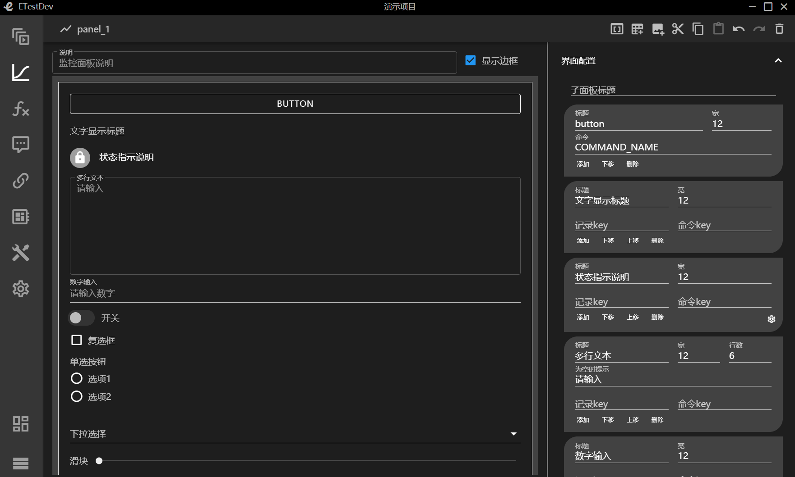
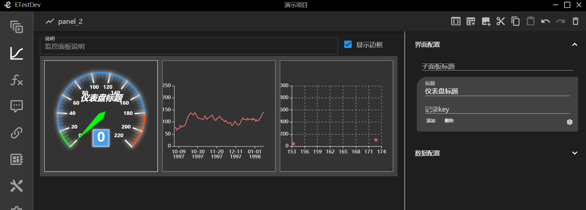
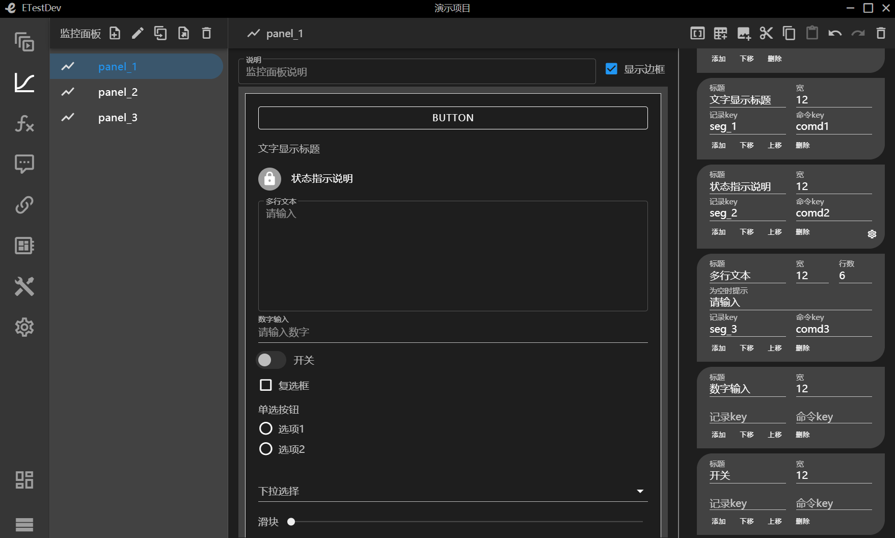
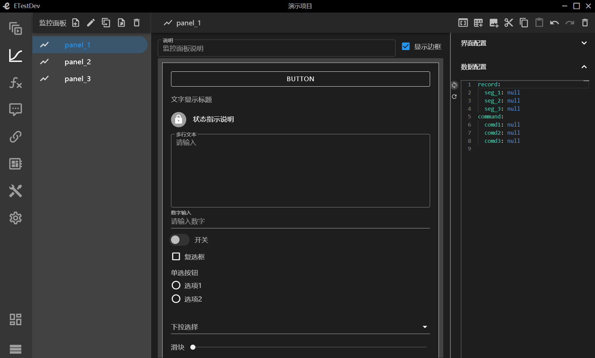

# 前言
## 什么是ETestDev
ETestDev是嵌入式系统测试开发工具套件，由多个开发组件构成，主要包括ETL编译器、测试程序执行器、监控界面渲染器、多个组件库，以及vscode插件、命令行工具等
## 入门教程简介
我们在本入门教程中将会完成一个基于ETestDev开发工具套件运行的一个演示项目的例子
### 项目库
项目库是本系统内的所有项目进行一个统一的管理，支持新建项目、重命名项目、删除项目、收索项目、项目导入、项目导出、项目排序等一系列操作
#### 新建项目
+ 点击新建项目，输入项目名称、选择创建方式(包括空项目、复制历史项目、从文件导入)
+ 新建成功后会显示项目的基本信息，包括创建时间、修改时间、用例总数、执行结果等信息
+ 点击项目名称会进入到该项目的工作空间下
+ 当项目名称存在时候回报错(项目名重复)
+ ``` 这里以演示项目为例```

#### 重命名项目
+ 点击项目名称，输入新的项目名称，回车

#### 删除项目
+ 项目首页点击删除按钮，确定，项目就被删除了

#### 项目检索
+ 项目检索支持按照项目名称的关键字进行检索
+ 收索栏中输入要搜索的关键字，系统会自动的匹配

#### 项目排序
+ 项目排序支持按照项目名称、创建时间、修改时间、用例总数、执行结果升序或者降序排列
+ 选择排序所需要的依据与排序的顺序，系统会自动对项目进行排序

#### 项目导出
+ 支持把项目导出为文件，包含本项目下的所有信息

#### 在新窗口打开
+ 当我们需要同时操作多个项目的时候，选择在新窗口打开
+ 这样我们就同时在多个窗口打开了多个项目

### 设备接口
设备接口是对本项目下的所有的设备、设备的接口、以及接口类型参数名称的一个统一的管理。支持设备、接口的新增编辑以及接口参数的配置等操作。以下所有操作均在设备接口菜单栏下进行操作

#### 设备新增
+ 点击新增按钮，输入设备名称(不支持特殊字符，全数字)回车
+ ```这里以新增设备1、设备2、设备3为例```
+ ```新增完成后如下图所示```


#### 设备删除
+ 选择要删除的设备，点击删除按钮

#### 设备说明
+ 选择设备，在设备说明栏中输入信息
+ 设备说明信息是实时保存状态

#### 接口功能说明
+ 如下所示依次为向前添加、向后添加、上移、下移、复制、粘贴、撤销、恢复、删除


#### 接口新增
+ 新增支持向前添加或者向后添加
+ 选择要增加的接口类型，输入数量与名称回车
+ 接口名称不支持特殊字符，全数字，系统会根据接口数量依次命名
+ ```这里给设备1增加类型为di的5个接口，名称分别为din_1~din_5，给设备增加类型为do的5个接口，名称分别为dout_1~dout_5```
+ ```设备1新增完成后如下图所示```

+ ```设备2新增完成后如下图所示```

+ 接口类型后面做详细介绍

#### 接口重命名
+ 选择接口名称，输出新名称(或者说明信息)确定，取消回退到上一步
+ 接口名称不可以重复

#### 接口移动
+ 接口移动分为上移、下移
+ 选中某一项，根据需求进行上下移动顺序的调整

#### 接口复制粘贴
+ 选中某一项接口时点击复制后就可以进行粘贴操作
+ 复制粘贴出的接口会出现接口名称重复的错误，需要及时修改名称

#### 接口撤销恢复
+ 撤销回复与前进一步后退一步相同
+ 出现操作失误等状况可以用此功能来解决

#### 接口删除
+ 选中要删除的那一项接口，点击删除

#### 接口类型
+ 接口类型共分为11种分别是di、do、ad、da、serial_232、serial_422、serial_485、serial_ttl、udp、tcp_client、tcp_server
+ di、do分别表示开关量的输入与输出。参数为最大工作电压，可以手动设置
+ ad、da分别表示模拟信号转变为数字信号，数字信号转换为模拟信号。可选参数为分辨率(包括8、16、32、64)
+ udp表示无连接的传输层协议。参数为IP地址、端口号、存活周期、是否复用地址端口
+ tcp_client、tcp_server分别表示tcp客户端与tcp服务端。参数为IP地址、端口号、是否长连接、是否禁用Nagle、是否自动连接
+ serial_232、serial_422、serial_485、serial_ttl分别表示串口232、422、485、ttl。参数均为可选参数波特率、数据位、停止位、校验方式、流控方式

### 连接拓扑
连接拓扑是表示项目下的设备接口的拓扑关系，支持拓扑新增、编辑、删除、设备的映射、接口的连接、运行时接口的绑定等信息

#### 连接拓扑新建
+ 点击新增按钮输入名称回车
+ 说明的信息栏中可以输入连接拓扑的详细说明
+ 拓扑名称不能重复不支持非法字符，不支持全数字
+ ```这里以新增topo1、topo2为例```
+ ```新增完成后如下图所示，右侧可以清楚的看到增加的三个设备```


#### 拓扑重命名
+ 选择拓扑点击重命名输入新名称回车
+ 拓扑名称不能重复不支持非法字符，不支持全数字

#### 拓扑删除
+ 选择拓扑点击删除按钮

#### 设备的映射方式
+ ```这里以topo1为例，设备1选择仿真设备，设备2选择实物设备```
+ ```蓝色背景为仿真设备，灰色背景为实物设备```

#### 接口连接
+ ```按照上一步我们已经选择好的设备选择接口连接```
+ ```设备1的输入(din1)对应设备2的输出(dout_1)设置完成如下所示```


#### 运行时接口绑定
+ 运行时接口绑定需要输入测试工具接口的名称


### 通信协议
通信协议表示项目下设备之间通信所使用的协议，支持协议以及子协议的编辑、复制、设置属性等多种操作

#### 通信协议新增
+ 点击新增按钮，输入协议名称(不支持特殊字符，全数字)回车
+ 说明的信息栏中可以对此协议进行详细的说明
+ 通信协议名称不能重复不支持非法字符，不支持全数字
+ ```这里以新增protocol_1、protocol_2、protocol_3为例```


#### 新增通信协议的测试
+ 需要测试的协议需要经过错误检查，否则会有错误提示
+ 单个协议的编写完整，即可进行测试

#### 通信协议重命名
+ 选中要重新命名的那一项点击重命名按钮，输入名称(不支持特殊字符，全数字)回车
+ 通信协议名称唯一，不能出现重复

#### 通信协议删除
+ 点击删除，这样选中的就被删除掉了

#### 功能介绍
+ 第一个图标表示添加子集，适用于协议组中添加协议段
+ 其余同设备接口


#### 新增协议段、协议分组
+ 新增的同一层次的名称不能出现重复
+ ```新增一个名为groups的协议段分组，数组长度默认为空，数量为1```
+ ```选中协议分组，添加子集类型为协议段，名称为seg_int、数量为1、长度默认为空、解析方式为int8```
+ ```设置自动赋值属性为0```
+ ```同时方式在协议分组中新增string类型协议段、uint协议段等，并设置解析方式```
+ ```新增完成之后在协议组的同级新增名称为seg_number的协议段、数量为1并设置其解析方式```
+ ```新增成功后如下所示```


#### 新增动态分支
+ 动态分支是根据某一个协议段所赋的值进行判断，选择哪一条协议分支
+ ```根据协议段seg_number进行动态分支的判断条件```
+ ```选中协议段seg_number添加动态分支，数量为1，添加分支条件this.seg_number == 1```
+ ```添加子协议，类型协议段，名称oneof_int、数量为1、解析方式int8、长度默认并设置autovalue属性```
+ ```以此方式再增加几个协议段等```
+ ```分支条件this.seg_number == 1```

+ ```分支条件this.seg_number == 2```


####  协议段、协议分组编辑
+ 选择名称可以设置数组长度，说明，以及名称的重命名
+ 选择解析方式与设置均可以设置解析方式与自动赋值属性
+ 解析方式支持多种，后面做详细介绍

#### 协议段、协议分组的解析方式
+ int1至int64 表示有符号整数1至64位
+ uint1至uint64 表示无符号整数1至64位
+ string 表示字符串，当解析方式设置为string时需要设置length(长度)属性或endwith(结尾符)属性(二者均赋值时，属性length有效)
+ float 表示单精度型浮点数据
+ double 表示双精度型浮点数据
+ autovalue属性赋值要遵循协议解析原则，不能超出解析方式范围

### 监控面板
监控面板主要是监控测试程序的的实时输出，并且把实时状态以图像化的界面展示出来。分为图形化子面板(按钮、文字显示、状态指示、文字输入、多行文本输入、数字输入、开关按钮、复选框、单选框、下拉选择、复合选择、滑块)，界面子面板(仪表、曲线、散点)

#### 新增监控面板
+ 点击新增按钮，输入监控面板名称(不支持特殊字符，全数字)回车
+ 说明的信息栏中可以对此监控面板进行详细的说明
+ 监控面板名称不能重复不支持非法字符，不支持全数字
+ ```这里以新增panel_1、panel_2、panel_3为例```
+ `灰色背景的矩形表示监控面板、灰色背景上的黑色矩形表示监控子面板`


#### 监控面板重命名
+ 选中要重新命名的那一项点击重命名按钮，输入名称(不支持特殊字符，全数字)回车
+ 监控面板名称唯一，不能出现重复

#### 监控面板删除
+ 点击删除，这样选中的就被删除掉了

#### 监控面板图标功能介绍
+ 鼠标选中自动弹出功能名称
+ 依次为 显示/隐藏属性设置、添加部件子面板、添加图形子面板、复制、粘贴、撤销、恢复、删除


#### 新增部件子面板
+ 新增部件子面板界面配置项可以设置子面板标题
+ `子面板标题设置为标题1`
+ `添加按钮新增按钮，可以设置按钮标题(按钮)宽度(12)与命令，命令是指点击按钮测试程序要发出去的指令`
+ `新增文字显示，可以设置标题(文字显示)、宽度(12)、记录的key(记录在系统record中的key值)、命令的key(发送的控制指令的key值)`
+ `新增状态指示说明，可设置value值的显示状态(如：当value为1，设置为红色，当value值为0设置为白色)`
+ `新增多行文本输出，可以设置标题、宽、行数、为空时提示、记录key、命令key`
+ `设置的具体参数后面做详细介绍`


#### 部件子面板
+ 部件子面板同时具有上移、下移、删除等操作
+ 见图新增部件子面板


#### 新增图形子面板 
+ `新增仪表盘，设置可以设置仪表盘要记录的key值`
+ `新增曲线，设置x轴记录的key与y轴记录的key`
+ `新增散点，设置x轴记录的key与y轴记录的key`
+ `设置的具体参数后面做详细介绍`


#### 图形子面板
+ 图形子面板具有新增、删除等操作

#### 部件子面板的参数配置
+ 这里介绍了每个子面板具体类型的参数设置
+ 状态指示说明举例
    ```yml
    value: 0
    foreground: white 
    background: grey
    icon: mdi-lock
    value: 1
    foreground: red
    background: white
    icon: mdi-lock-open  #icon表示引用的图标，icon对应的值表示引用图标的名称

    #当value的值为0时，前景色为白色，背景色为灰色；当value的值为0时，前景色为红色，背景色为白色
    ```
+ 单选按钮说明举例
    ```yml
    value: 1   
    text: 选项1
    value: 2
    text: 选项2
    #以上说明，当选择的文本选项1时，对应的value值为1时 ，当选择的文本选项为选项2时，对应的value值为2 
    ```
+ 下拉选择举例同单选按钮
+ 复合选择举例说明(符合选择支持选择，同时也支持手动输入)
    ```yml
    选项1
    选项2
    #当复合选择的选项为选项1，选项2时，支持从选项1，选项2中选择，也支持手动输出所需要的参数
    ```

#### 图形子面板的参数配置
+ 仪表盘参数说明
    ```yml
    series:
      - min: 0 #最小刻度0
        max: 220 #最大刻度220
        splitNumber: 11 #共分成11分
        radius: 90% #仪表盘半径，可以是相对于容器高宽中较小的一项的一半的百分比，也可以是绝对的数值
        axisLine: #仪表盘轴线相关配置
          lineStyle: #仪表盘轴线样式
            color: #仪表盘的轴线颜色(可以被分成不同颜色的多段。每段的结束位置和颜色可以通过一个数组来表示)
              - - 0.09  #颜色段的范围
                - lime # 设置颜色段的颜色
              - - 0.82
                - '#1e90ff'
              - - 1
                - '#ff4500'
            width: 3 #外部轴线的宽度
            shadowColor: '#fff' #设置阴影颜色
            shadowBlur: 10 # 设置阴影颜色的模糊的大小
        axisLabel:
          fontWeight: bolder #设置字体属性，字体加粗
          color: '#fff'  #设置字体颜色
          shadowColor: '#fff' #设置阴影颜色
          shadowBlur: 10 #设置阴影颜色的模糊级数
        axisTick: #刻度样式
          length: 15 # 刻度线长。支持相对半径的百分比
          lineStyle: #线的样式
            color: auto  #线的颜色
            shadowColor: '#fff' #阴影颜色
            shadowBlur: 10 #图形阴影的模糊大小
        splitLine: #分隔线样式
          length: 25 #分隔线线长。支持相对半径的百yanze分比
          lineStyle: #分割线的样式
            width: 3 # 线宽
            color: '#fff' #线的颜色
            shadowColor: '#fff' #阴影颜色
            shadowBlur: 10 #图形阴影的模糊大小
        pointer: #设置指针
          shadowColor: '#fff' #阴影颜色
          shadowBlur: 5 #图形阴影的模糊大小
        title:  #仪表盘标-线的颜色
            shadowColor: '#fff' #阴影颜色
            shadowBlur: 10 #图形阴影的模糊大小
        splitLine: #分隔线样式
          length: 25 #分隔线线长。支持相对半径的百yanze分比
          lineStyle: #分割线的样式
            width: 3 # 线宽
            color: '#fff' #线的颜色
            shadowColor: '#fff' #阴影颜色
            shadowBlur: 10 #图形阴影的模糊大小
        pointer: #设置指针
          shadowColor: '#fff' #阴影颜色
          shadowBlur: 5 #图形阴影的模糊大小
        title:  #仪表盘标题
          textStyle:  # 文本样式
            fontWeight: bolder #设置字体样式
            fontSize: 20  #设置字体尺寸
            fontStyle: italic #设置字体风格
            color: '#fff' #设置字体颜色
            shadowColor: '#fff'  #阴影颜色
            shadowBlur: 10 #图形阴影的模糊大小
        detail: #仪表详情，用于展示数据
          backgroundColor: 'rgba(30,144,255,0.8)' #文字块背景色（可以使用颜色值，也可以直接使用图片）
          borderWidth: 1  #文字块边框宽度
          borderColor: '#fff' #文字块边框颜色
          shadowColor: '#fff' #阴影颜色
          shadowBlur: 5 #图形阴影的模糊大小
          offsetCenter: #相对于仪表盘中心的偏移位置。可以是绝对的数值，也可以是相对于仪表盘半径的百分比。
            - 0  #水平方向的偏移
            - 50% #垂直方向的偏移
          textStyle: #设置文本样式
            fontWeight: bolder  #设置字体样式
            color: '#fff'  #设置字体颜色
    
    ```
+ 曲线参数说明，当设置多条曲线时，坐标轴的方式只需要在第一条设置
    ```yml
    tooltip: #本坐标系特定的 tooltip 设定
      # item ：数据项图形触发，主要在散点图，饼图等无类目轴的图表中使用
      # axis ：坐标轴触发，主要在柱状图，折线图等会使用类目轴的图表中使用
      # none ：什么都不触发
      trigg: axis #触发类型
      axisPointer: #坐标轴指示器配置项
        animation: false # 是否开启动画 支持参数[true,false]
    xAxis: #设置x轴属性
      # value ： 数值轴，适用于连续数据
      # log ：对数轴。适用于对数数据
      # time ： 时间轴，适用于连续的时序数据，与数值轴相比时间轴带有时间的格式化，在刻度计算上也有所不同，例如会根据跨度的范围来决定使用月，星期，日还是小时范围的刻度
      # category ： 类目轴，适用于离散的类目数据。为该类型时类目数据可自动从 series.data 或 dataset.source 中取，或者可通过 xAxis.data 设置类目数据
      type: time #坐标轴类型
      splitLine: #分割线
        show: false # 是否显示分隔线。默认数值轴显示，类目轴不显示
    yAxis: #设置y轴属性
      type: value #坐标轴类型
      boundaryGap: #坐标轴两边留白策略
        # 类目轴中 boundaryGap 可以配置为 true 和 false。默认为 true，这时候刻度只是作为分隔线，标签和数据点都会在两个刻度之间的带(band)中间
        # 非类目轴，包括时间，数值，对数轴，boundaryGap是一个两个值的数组，分别表示数据最小值和最大值的延伸范围，可以直接设置数值或者相对的百分比，在设置 min 和 max 后无效
        - 0
        - 10发生的0%
      splitLine: #分割线
        show: false # 是否显示分隔线。默认数值轴显示，类目轴不显示
    series: #系列列表。每个系列通过 type 决定自己的图表类型
      - type: line #设置类型，折线图是用折线将各个数据点标志连接起来的图表，用于展现数据的变化趋势
        showSymbol: false # 是否显示 symbol, 如果 false 则只有在 tooltip hover 的时候显示
        hoverAnimation: false #是否开启 hover 在拐点标志上的提示动画效果
    ```
+ 散点图参数说明
    ```yml
    xAxis: #设置x轴属性
      scale: true # 是否是脱离 0 值比例。设置成 true 后坐标刻度不会强制包含零刻度。在双数值轴的散点图中比较有用
    yAxis: #设置y轴属性
      scale: true # 是否是脱离 0 值比例。设置成 true 后坐标刻度不会强制包含零刻度。在双数值轴的散点图中比较有用
    series: #系列列表。每个系列通过 type 决定自己的图表类型
      - type: effectScatter # 设置类型，带有涟漪特效动画的散点（气泡）图
        symbolSize: 8 # 标记的大小，也可以用数组分开表示宽和高，例如 [20, 10] 表示标记宽为20，高为10
        data: # 系列中的数据内容数组。数组项通常为具体的数据项,通常为多维数组 [[172.7, 105.2], [153.4, 42]]
          - - 172.7 
            - 105.2
          - - 153.4
            - 42

    ```
+ 注意： `监控面板设置中可以使用js代码函数`
+ 使用方法：`!!js/function 'function (){...}'`此函数也可以使用匿名函数

#### 数据配置
+ 包括两个record与command
+ record指需要记录在系统中的key值，command要下发的控制指令的key值
+ `标题记录key为seg_1,命令key为comd1 ......`
+ `数据配置的参数说明`



### 项目设置
项目设置是设置项目包括了项目的基本设置，自定义校验函数，自定义打包函数，自定义解包函数，接收过滤器等功能

#### 基本设置
+ 设置项目的说明，对本项目的信息加一个说明
+ 设置执行器的IP地址与端口号进行连接测试

#### 自定义校验函数
+ 是对本项目中的数据进行校验(使用一个自定义校验的方法)
+ 可以编写一个或多个自定义的校验函数
+ 支持对代码语法错误的自检功能
+ 支持输入任意数据进行查找
+ 支持打开或者关闭注释功能
+ 支持剪切、复制、粘贴、撤销、恢复
+ 支持鼠标移动到图标上会显示该功能


#### 自定义打包函数
+ 对项目中的数据进行打包(使用自定义的方法进行打包)
+ 可以编写一个或多个自定义的打包函数
+ 支持对代码语法错误的自检功能
+ 详细功能同自定义校验函数

#### 自定义解包函数
+ 对项目中的数据进行解包(使用自定义的方法进行解包)
+ 可以编写一个或多个自定义的解包函数
+ 支持对代码语法错误的自检功能
+ 详细功能同自定义校验函数

#### 接收过滤器
+ 对项目中接收的数据进行过滤(使用自定义的方法)
+ 可以编写一个或多个自定义的过滤器函数
+ 支持对代码语法错误的自检功能
+ 详细功能同自定义校验函数

### 执行用例
执行用例是对项目中的用例进行执行的操作，用例执行时需要选择拓扑连接、监控面板、执行方式、实时调度周期等参数。输出参数为Yaml格式，在独立的窗口中进行，代码编辑窗口下面有详细的输出结果

#### 新增
+ 支持三种新增方式，包括目录、ETLua脚本、AutoTCG
+ 可以指定目录下新增ETLua脚本、AutoTCG
+ 同一项目下名称不能重复不支持非法字符，不支持全数字
+ 新增的节点支持拖拽功能(点击图标进行拖拽)

#### 重命名
+ 选中要修改的那一项，输入新的名称，回车

#### 删除
+ 选中要删除的那一项，确定，就被删除了
+ 当被删除的时目录的时候，目录中的文件一并也被删除

#### ETLua脚本
+ ETLua脚本是测试用例的脚本信息
+ 用例执行的控制台输出，以颜色区分结果，以前导图标区分类型
+ 红色为错误、断言失败、检查失败
+ 黄色为警告
+ 绿色检查判断成功
+ 白色为普通输出
+ &gt; 为用户脚本输出信息
+ i为执行器输出的系统信息
+ 。为record记录生成，鼠标移到图标上有数据内容提示
+ 系统输出的文字内容是灰色的，与程序脚本内容的输出有很大的反差

#### AutoTCG

### 工具箱

#### 数据格式转换
+ 支持数据转换的类型分别为`JSON`,`Excel`,`Yaml`,`JavaScript(代码执行输出结果)`


