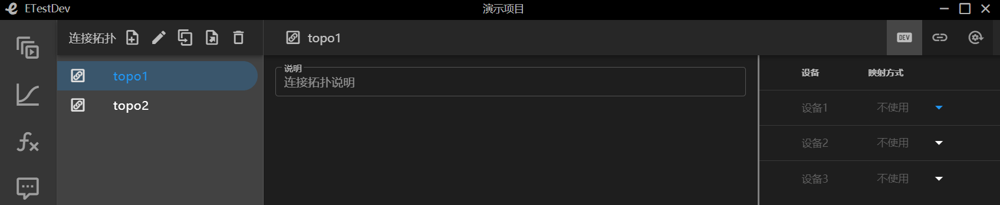
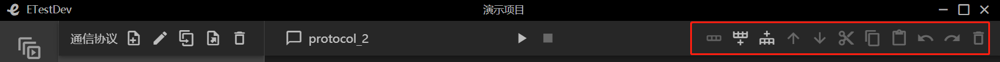
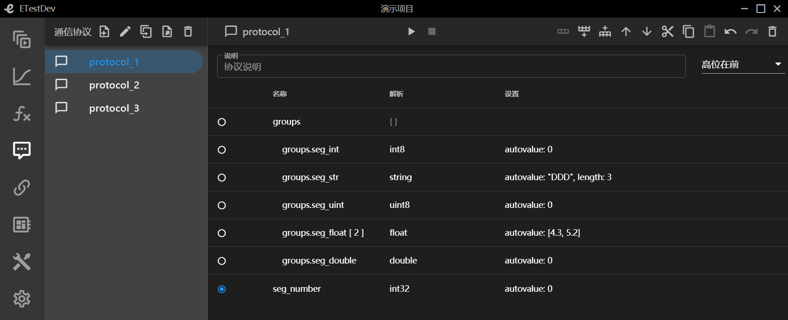
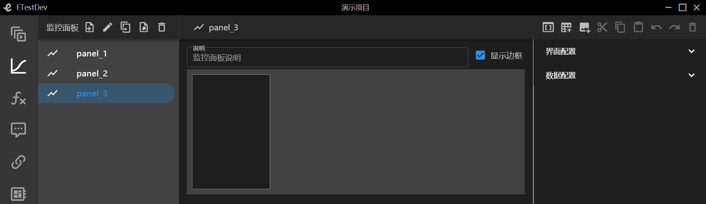

# 前言
## 什么是ETestDev
ETestDev是嵌入式系统测试开发工具套件，由多个开发组件构成，主要包括ETL编译器、测试程序执行器、监控界面渲染器、多个组件库，以及vscode插件、命令行工具等
## 入门教程简介
我们在本入门教程中将会完成一个基于ETestDev开发工具套件运行的一个演示项目的例子
### 项目库
项目库是本系统内的所有项目进行一个统一的管理，支持新建项目、重命名项目、删除项目、收索项目、项目导入、项目导出、项目排序等一系列操作
#### 新建项目
+ 点击新建项目，输入项目名称、选择创建方式(包括空项目、复制历史项目、从文件导入)
+ 新建成功后会显示项目的基本信息，包括创建时间、修改时间、用例总数、执行结果等信息
+ 点击项目名称会进入到该项目的工作空间下
+ 当项目名称存在时候回报错(项目名重复)
+ ``` 这里以演示项目为例```

#### 重命名项目
+ 点击项目名称，输入新的项目名称，回车

#### 删除项目
+ 项目首页点击删除按钮，确定，项目就被删除了

#### 项目检索
+ 项目检索支持按照项目名称的关键字进行检索
+ 收索栏中输入要搜索的关键字，系统会自动的匹配

#### 项目排序
+ 项目排序支持按照项目名称、创建时间、修改时间、用例总数、执行结果升序或者降序排列
+ 选择排序所需要的依据与排序的顺序，系统会自动对项目进行排序

#### 项目导出
+ 支持把项目导出为文件，包含本项目下的所有信息

#### 在新窗口打开
+ 当我们需要同时操作多个项目的时候，选择在新窗口打开
+ 这样我们就同时在多个窗口打开了多个项目

### 设备接口
设备接口是对本项目下的所有的设备、设备的接口、以及接口类型参数名称的一个统一的管理。支持设备、接口的新增编辑以及接口参数的配置等操作。以下所有操作均在设备接口菜单栏下进行操作

#### 设备新增
+ 点击新增按钮，输入设备名称(不支持特殊字符，全数字)回车
+ ```这里以新增设备1、设备2、设备3为例```
+ ```新增完成后如下图所示```


#### 设备删除
+ 选择要删除的设备，点击删除按钮

#### 设备说明
+ 选择设备，在设备说明栏中输入信息
+ 设备说明信息是实时保存状态

#### 接口功能说明
+ 如下所示依次为向前添加、向后添加、上移、下移、复制、粘贴、撤销、恢复、删除


#### 接口新增
+ 新增支持向前添加或者向后添加
+ 选择要增加的接口类型，输入数量与名称回车
+ 接口名称不支持特殊字符，全数字，系统会根据接口数量依次命名
+ ```这里给设备1增加类型为di的5个接口，名称分别为din_1~din_5，给设备增加类型为do的5个接口，名称分别为dout_1~dout_5```
+ ```设备1新增完成后如下图所示```

+ ```设备2新增完成后如下图所示```

+ 接口类型后面做详细介绍

#### 接口重命名
+ 选择接口名称，输出新名称(或者说明信息)确定，取消回退到上一步
+ 接口名称不可以重复

#### 接口移动
+ 接口移动分为上移、下移
+ 选中某一项，根据需求进行上下移动顺序的调整

#### 接口复制粘贴
+ 选中某一项接口时点击复制后就可以进行粘贴操作
+ 复制粘贴出的接口会出现接口名称重复的错误，需要及时修改名称

#### 接口撤销恢复
+ 撤销回复与前进一步后退一步相同
+ 出现操作失误等状况可以用此功能来解决

#### 接口删除
+ 选中要删除的那一项接口，点击删除

#### 接口类型
+ 接口类型共分为11种分别是di、do、ad、da、serial_232、serial_422、serial_485、serial_ttl、udp、tcp_client、tcp_server
+ di、do分别表示开关量的输入与输出。参数为最大工作电压，可以手动设置
+ ad、da分别表示模拟信号转变为数字信号，数字信号转换为模拟信号。可选参数为分辨率(包括8、16、32、64)
+ udp表示无连接的传输层协议。参数为IP地址、端口号、存活周期、是否复用地址端口
+ tcp_client、tcp_server分别表示tcp客户端与tcp服务端。参数为IP地址、端口号、是否长连接、是否禁用Nagle、是否自动连接
+ serial_232、serial_422、serial_485、serial_ttl分别表示串口232、422、485、ttl。参数均为可选参数波特率、数据位、停止位、校验方式、流控方式

### 连接拓扑
连接拓扑是表示项目下的设备接口的拓扑关系，支持拓扑新增、编辑、删除、设备的映射、接口的连接、运行时接口的绑定等信息

#### 连接拓扑新建
+ 点击新增按钮输入名称回车
+ 说明的信息栏中可以输入连接拓扑的详细说明
+ 拓扑名称不能重复不支持非法字符，不支持全数字
+ ```这里以新增topo1、topo2为例```
+ ```新增完成后如下图所示，右侧可以清楚的看到增加的三个设备```


#### 拓扑重命名
+ 选择拓扑点击重命名输入新名称回车
+ 拓扑名称不能重复不支持非法字符，不支持全数字

#### 拓扑删除
+ 选择拓扑点击删除按钮

#### 设备的映射方式
+ ```这里以topo1为例，设备1选择仿真设备，设备2选择实物设备```
+ ```蓝色背景为仿真设备，灰色背景为实物设备```

#### 接口连接
+ ```按照上一步我们已经选择好的设备选择接口连接```
+ ```设备1的输入(din1)对应设备2的输出(dout_1)设置完成如下所示```


#### 运行时接口绑定
+ 运行时接口绑定需要输入测试工具接口的名称


### 通信协议
通信协议表示项目下设备之间通信所使用的协议，支持协议以及子协议的编辑、复制、设置属性等多种操作

#### 通信协议新增
+ 点击新增按钮，输入协议名称(不支持特殊字符，全数字)回车
+ 说明的信息栏中可以对此协议进行详细的说明
+ 通信协议名称不能重复不支持非法字符，不支持全数字
+ ```这里以新增protocol_1、protocol_2、protocol_3为例```


#### 通信协议重命名
+ 选中要重新命名的那一项点击重命名按钮，输入名称(不支持特殊字符，全数字)回车
+ 通信协议名称唯一，不能出现重复

#### 通信协议删除
+ 点击删除，这样选中的就被删除掉了

#### 功能介绍
+ 第一个图标表示添加子集，适用于协议组中添加协议段
+ 其余同设备接口


#### 新增协议段、协议分组
+ 新增的同一层次的名称不能出现重复
+ ```新增一个名为groups的协议段分组，数组长度默认为空，数量为1```
+ ```选中协议分组，添加子集类型为协议段，名称为seg_int、数量为1、长度默认为空、解析方式为int8```
+ ```设置自动赋值属性为0```
+ ```同时方式在协议分组中新增string类型协议段、uint协议段等，并设置解析方式```
+ ```新增完成之后在协议组的同级新增名称为seg_number的协议段、数量为1并设置其解析方式```
+ ```新增成功后如下所示```


#### 新增动态分支
+ 动态分支是根据某一个协议段所赋的值进行判断，选择哪一条协议分支
+ ```根据协议段seg_number进行动态分支的判断条件```
+ ```选中协议段seg_number添加动态分支，数量为1，添加分支条件this.seg_number == 1```
+ ```添加子协议，类型协议段，名称oneof_int、数量为1、解析方式int8、长度默认并设置autovalue属性```
+ ```以此方式再增加几个协议段等```
+ ```分支条件this.seg_number == 1```

+ ```分支条件this.seg_number == 2```


####  协议段、协议分组编辑
+ 选择名称可以设置数组长度，说明，以及名称的重命名
+ 选择解析方式与设置均可以设置解析方式与自动赋值属性
+ 解析方式支持多种，后面做详细介绍

#### 协议段、协议分组的解析方式
+ int1至int64 表示有符号整数1至64位
+ uint1至uint64 表示无符号整数1至64位
+ string 表示字符串，当解析方式设置为string时需要设置length(长度)属性或endwith(结尾符)属性(二者均赋值时，属性length有效)
+ float 表示单精度型浮点数据
+ double 表示双精度型浮点数据
+ autovalue属性赋值要遵循协议解析原则，不能超出解析方式范围

### 监控面板
监控面板主要是监控测试程序的的实时输出，并且把实时状态以图像化的界面展示出来。分为图形化子面板(按钮、文字显示、状态指示、文字输入、多行文本输入、数字输入、开关按钮、复选框、单选框、下拉选择、复合选择、滑块)，界面子面板(仪表、曲线、散点)

#### 新增监控面板
+ 点击新增按钮，输入监控面板名称(不支持特殊字符，全数字)回车
+ 说明的信息栏中可以对此监控面板进行详细的说明
+ 监控面板名称不能重复不支持非法字符，不支持全数字
+ ```这里以新增panel_1、panel_2、panel_3为例```
+ `灰色背景的矩形表示监控面板、灰色背景上的黑色矩形表示监控子面板`


#### 监控面板重命名
+ 选中要重新命名的那一项点击重命名按钮，输入名称(不支持特殊字符，全数字)回车
+ 监控面板名称唯一，不能出现重复

#### 监控面板删除
+ 点击删除，这样选中的就被删除掉了

#### 监控面板图标功能介绍
+ 鼠标选中自动弹出功能名称
+ 依次为 显示/隐藏属性设置、添加部件子面板、添加图形子面板、复制、粘贴、撤销、恢复、删除


#### 新增部件子面板
+ 新增部件子面板界面配置项可以设置子面板标题
+ `子面板标题设置为标题1`
+ `添加按钮`


#### 新增图形子面板 


